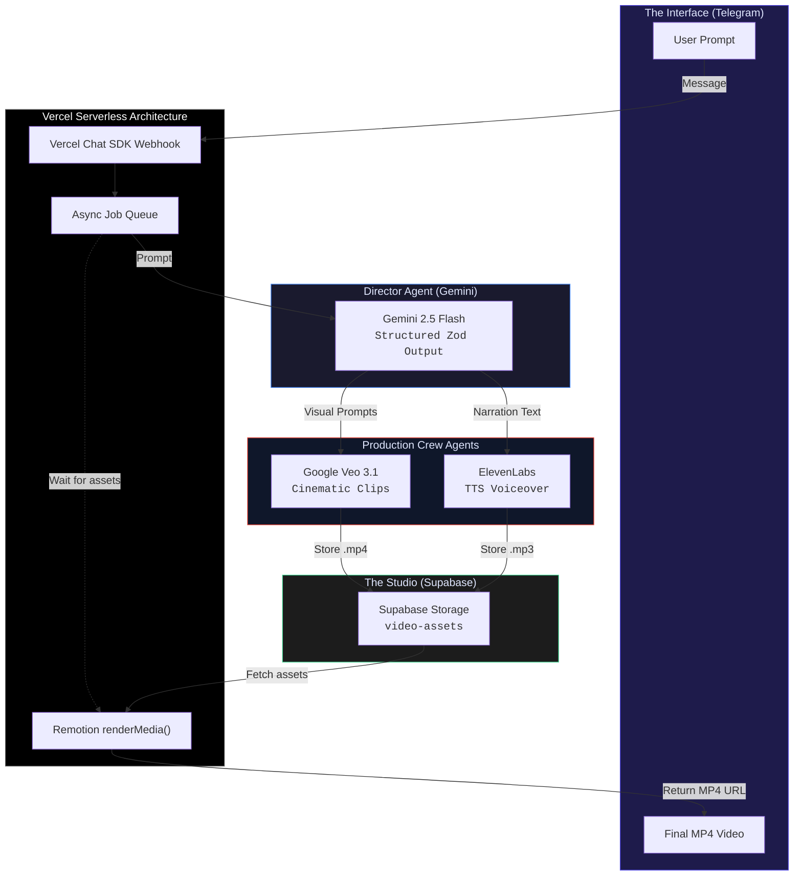
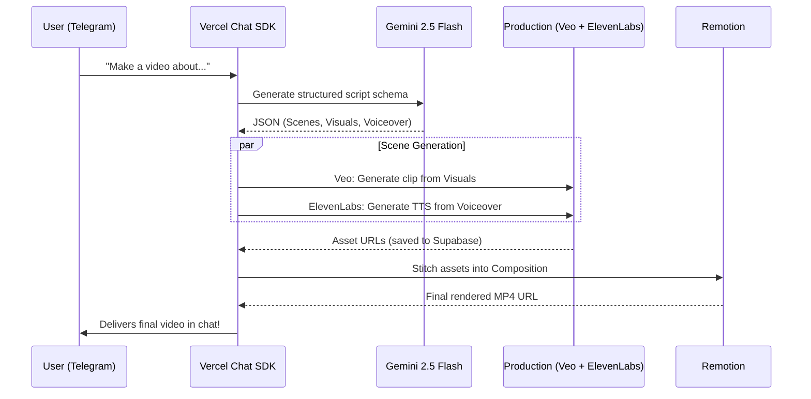

<p align="center">
  
  
  
  
  
</p>

<h1 align="center">FlowMotion</h1>
<h3 align="center">Autonomous AI Video Agent &mdash; From Telegram Prompt to MP4 in Minutes</h3>

<p align="center">
  A multi-agent video production studio that compresses a multi-day studio workflow into a single chat message. It orchestrates Gemini 2.5 Flash as the "Director Agent", Veo 3.1 as the "Cinematographer", and ElevenLabs as the "Voice Actor", stitching everything together via Remotion directly from Telegram.
</p>

<p align="center">
  <a href="https://cerebralvalley.ai/e/zero-to-agent-sf"><strong>Submission for Zero to Agent: Vercel x DeepMind Hackathon | San Francisco, March 2026</strong></a>
</p>

---

## The Problem

**Video production is fragmented, expensive, and time-intensive.** When a marketing team needs a 30-second promotional video:

| Pain Point | Impact |
|------------|--------|
| **Multi-day turnaround** | Writing, storyboarding, sourcing footage, and editing takes days |
| **High costs** | Stock footage licenses, voice actors, and editors are expensive |
| **Tool fragmentation** | Switching between ChatGPT for scripts, Midjourney for assets, and Premiere for editing |
| **Steep learning curve** | Video timeline editing requires specialized software skills |

**The result:** High-quality video content remains inaccessible for quick iterations, educators, and indie hackers without massive budgets.

---

## The Solution

**FlowMotion** democratizes video creation by turning a single Telegram message into a fully composed, production-ready video. A sophisticated multi-model pipeline works completely autonomously behind the scenes, bridging the gap between cutting-edge generative AI and end-user simplicity.

### The "3 AM Video Request" Story

> It's 3:00 AM. A founder realizes they need a quick product teaser video for a Product Hunt launch tomorrow morning.
>
> They open Telegram and message FlowMotion: *"Generate a 30-second cinematic teaser for a new AI coffee machine set in a futuristic cafe."*
>
> Behind the scenes, **Vercel Chat SDK** routes the webhook. **Gemini 2.5 Flash** instantly writes a 4-scene script with exact camera movements and narration. **Veo 3.1** begins rendering breathtaking 4K clips for each scene while **ElevenLabs** generates the voiceover. **Remotion** automatically stitches the clips, overlays text, and renders the final MP4.
>
> The bot replies: *"Here is your video."* **Total time: 5 minutes.**

---

## Multimodal Pipeline Showcase

This project answers the "Zero to Agent" challenge by taking full advantage of Vercel's agent stack infrastructure and Gemini's multimodal reasoning to create a tool people actually want to use:

| Role | Technology | What It Does |
|------|------------|--------------|
| **The Interface** | Vercel Chat SDK (`@chat-adapter/telegram`) | Replaces complex Telegram API boilerplate with a beautiful, unified developer experience for handling direct messages and webhooks. |
| **Director Agent** | Google Gemini 2.5 Flash | Uses strict Zod schemas to output a highly structured, scene-by-scene script with visual descriptions, camera directions, and TTS narration. |
| **Cinematographer Agent** | Google Veo 3.1 | Translates Gemini's hyper-detailed visual prompts into breathtaking, cinematic video clips matching the required mood and duration. |
| **Voice Actor Agent** | ElevenLabs | Generates incredibly realistic, emotional voiceovers perfectly synced to the generated script. |
| **The Editor** | Remotion | Programmatically stitches the Veo video clips and ElevenLabs audio together server-side into a final, exportable MP4 file. |
| **The Studio** | Supabase MCP | Provides storage buckets to seamlessly host the intermediate video and audio assets during the rendering pipeline. |

---

## Architecture



### Agent Handoff Flow

The entire process is completely hands-off. The output of one model perfectly dictates the input of the next:



---

## What Makes This Different

| Differentiator | Details |
|----------------|---------|
| **Zero UI Required** | Operates entirely via a Telegram bot. No complex video timelines to navigate. |
| **LLM-Directed Video** | Instead of manually prompting video models, an LLM acts as the Director, ensuring visual cohesion and pacing. |
| **Programmatic Composition** | Remotion handles stitching entirely in code on the server, requiring zero manual editing. |
| **Unified Chat SDK** | Vercel's Chat SDK eliminates the pain of raw messaging APIs, allowing us to focus purely on the AI orchestration. |

---

## Tech Stack

| Component | Technology |
|-----------|-----------|
| Framework | Next.js 15 (App Router) |
| Hosting & Edge | Vercel Serverless Functions |
| Chat Interface | Vercel Chat SDK (`@chat-adapter/telegram`) |
| Scripting LLM | Google Gemini 2.5 Flash (`@google/genai`) |
| Video Generation | Google Veo 3.1 |
| Audio Generation | ElevenLabs |
| Video Rendering | Remotion (`renderMedia`) |
| Storage & Database | Supabase (Storage Buckets, MCP) |

---

## Quick Start

### 1. Clone the Repository

```bash
git clone https://github.com/yhinai/flowMotion.git
cd flowMotion
```

### 2. Set Up Environment Variables

Copy the example environment file:

```bash
cp .env.example .env.local
```

Fill in your API keys in `.env.local`:

```env
# Google (Gemini & Veo)
GEMINI_API_KEY=your_google_ai_key

# ElevenLabs (TTS Narration)
ELEVENLABS_API_KEY=your_elevenlabs_key

# Supabase (Storage & DB)
NEXT_PUBLIC_SUPABASE_URL=your_supabase_url
SUPABASE_SERVICE_ROLE_KEY=your_service_role_key

# Telegram Bot (Vercel Chat SDK)
TELEGRAM_BOT_TOKEN=your_bot_token
TELEGRAM_WEBHOOK_SECRET_TOKEN=your_webhook_secret
```

### 3. Install & Run Locally

```bash
npm install
npm run dev
```

Open `http://localhost:3000` to see the local Remotion preview environment.

### 4. Deploy to Vercel

```bash
npm i -g vercel
vercel
```
Ensure you add your `.env.local` variables to your Vercel project settings, and register your Vercel deployment URL as the Telegram webhook.

---

## Future Roadmap

- **Interactive Editing** — Reply to the bot with "change the second scene to be darker" to trigger targeted re-renders.
- **Multilingual Support** — Generate the exact same video but with dubbing and translated overlays for 10+ different languages.
- **Background Music Generation** — Integrate Lyria for dynamic background scores that match the mood of the Gemini script.
- **Style Presets** — Pass commands like `/style anime` or `/style cinematic` to instantly alter the Veo generation prompts.

---

## License

MIT

---

<p align="center">
  <strong>FlowMotion</strong> &mdash; Built for the <a href="https://cerebralvalley.ai/e/zero-to-agent-sf">Zero to Agent: Vercel x DeepMind Hackathon</a> in San Francisco, March 2026.
</p>